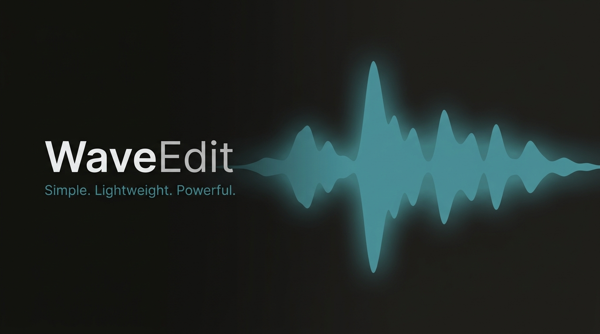

# WaveEdit

A cross-platform desktop audio editor built with **Electron** and the **Web Audio API**. Open a file, edit on the waveform, and export — all offline, with no account or cloud required.

## Features

- **Waveform editor** — zoom, pan, playhead, and timeline ruler
- **Selection tools** — select, trim, silence, fade, and markers
- **Region playback** — when a region is selected, only that range plays
- **Manual selection input** — set start/end times with `MM:SS.mmm` text fields
- **Edit operations** — trim, silence, normalize, reverse, fade in/out, undo
- **Export** — save edited audio as WAV (full track or selection only)
- **Native desktop integration** — file open/save dialogs, application menu, unsaved-changes prompt
- **Dark / light theme**

## Requirements

- [Node.js](https://nodejs.org/) 18 or later
- npm

## Getting started

```bash
# Install dependencies
npm install

# Run in development
npm start
```

## Building installers

```bash
# Windows (NSIS installer + portable .exe)
npm run build:win

# macOS (.dmg)
npm run build:mac

# Linux (AppImage + .deb)
npm run build:linux
```

Output is written to the `dist/` folder.

## Usage

### Opening files

- **File → Open** or the toolbar **Open** button
- Drag and drop an audio file onto the waveform area

Supported formats for import include WAV, MP3, OGG, FLAC, M4A, and AAC (decoded via the Web Audio API).

### Waveform navigation

| Action | Input |
|--------|--------|
| Zoom in / out | Toolbar buttons, mouse wheel, or **View** menu |
| Pan (when zoomed) | Right-click and drag on the waveform |
| Seek | Click on the waveform (Select tool) |
| Play / pause | Space or transport controls |

### Tools

| Tool | Behavior |
|------|----------|
| **Select** | Drag to highlight a region; click to seek |
| **Trim** | Drag a region, release to trim the file to that range |
| **Silence** | Drag a region, release to replace it with silence |
| **Fade** | Drag a region; fade in (left→right) or fade out (right→left) on release |
| **Add Marker** | Click to place a marker; opens the Markers tab |

You can also type selection start/end times in the toolbar and press **Enter** to apply.

When a region is selected, playback is limited to that range.

### Saving and exporting

- **Save** / **Save As** — writes the current edit as WAV
- **Export** — choose full track or selection only (WAV)

### Keyboard shortcuts

| Shortcut | Action |
|----------|--------|
| Ctrl/Cmd+O | Open |
| Ctrl/Cmd+S | Save |
| Ctrl/Cmd+Shift+S | Save As |
| Ctrl/Cmd+E | Export |
| Ctrl/Cmd+Z | Undo |
| Ctrl/Cmd+A | Select all |
| Space | Play / pause |
| T / S / M | Trim / Select / Mark tool |

## Project structure

```
WaveEdit/
├── build/           # App icon and build assets
├── electron/        # Main process, preload, native menus & file I/O
├── src/
│   ├── index.html   # App shell
│   ├── styles/      # Design tokens and layout
│   ├── renderer/    # Audio engine, waveform, editor, export
│   └── assets/      # Bundled UI assets
└── dist/            # Built installers (after npm run build)
```

## License

MIT
